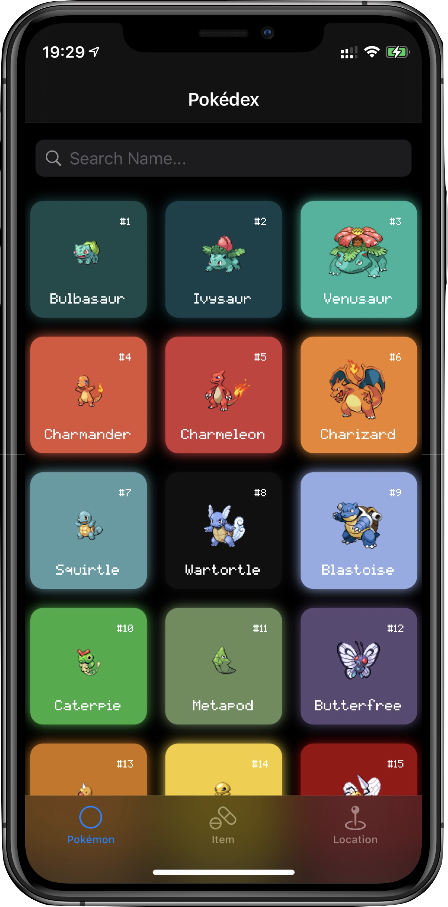

# PokeDex
My iOS Final Project, based on [Pokedex](https://github.com/oskarko/Pokedex) made by [oskarko](https://github.com/oskarko).

I have changed the UI of the app and add some new features.

# Views
+ PokemonView - The Pokemon array is presented in a GridView
  + Each cell presents the name, serial number and image of the Pokemon
+ ItemView - The item array is presented in a GridView
  + Each Cell presents the name of the item and its purpose, image and type
+ LocationView - The town road array is presented in a GridView
    + Each Cell shows the area where the town road is located (e.g. Shinjin is in Kanto, Kanto)
+ PokemonDetailView - a custom view showing details of each Pokemon
    + It will display basic information and basic stats such as HP, Attack, etc.
    + A Button to switch to the ARView
+ ARView - A view that displays a 3D model of the Pokémon
    + A 3D model of Pokémon, made possible by ARKit
+ CoreMLView - A view for uploading images and predicting the Pokémon
    + Train the model through CoreML and upload images from the media library for prediction

# Screenshot

# MIT License

Original work Copyright (c) 2018 Chester How

Modified work Copyright (c) 2021 4EVERNAIVE

Permission is hereby granted, free of charge, to any person obtaining a copy of this software and associated documentation files (the "Software"), to deal in the Software without restriction, including without limitation the rights to use, copy, modify, merge, publish, distribute, sublicense, and/or sell copies of the Software, and to permit persons to whom the Software is furnished to do so, subject to the following conditions:

The above copyright notice and this permission notice shall be included in all copies or substantial portions of the Software.

THE SOFTWARE IS PROVIDED "AS IS", WITHOUT WARRANTY OF ANY KIND, EXPRESS OR IMPLIED, INCLUDING BUT NOT LIMITED TO THE WARRANTIES OF MERCHANTABILITY, FITNESS FOR A PARTICULAR PURPOSE AND NONINFRINGEMENT. IN NO EVENT SHALL THE AUTHORS OR COPYRIGHT HOLDERS BE LIABLE FOR ANY CLAIM, DAMAGES OR OTHER LIABILITY, WHETHER IN AN ACTION OF CONTRACT, TORT OR OTHERWISE, ARISING FROM, OUT OF OR IN CONNECTION WITH THE SOFTWARE OR THE USE OR OTHER DEALINGS IN THE SOFTWARE.
